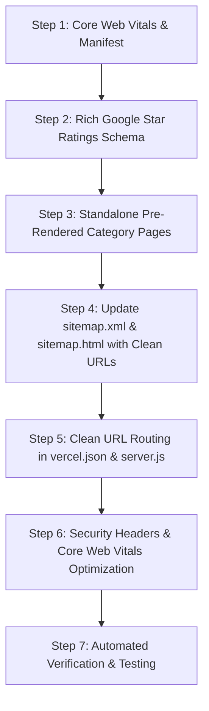

# Industry-Level Technical SEO Audit, Pros & Cons Analysis & Implementation Plan
**Domain:** `https://blushnbloomm.in` | **Brand:** Bloom&blush | **Date:** October 2026

---

## 1. Comprehensive SEO Audit Matrix (Pros & Cons)

| SEO Pillar | Current Strengths (PROS) | Vulnerabilities & Gaps (CONS) | Industry Solution (FIX) |
| :--- | :--- | :--- | :--- |
| **Crawlability & Rendering** | Clean robots.txt, dynamic JS routes, XML sitemap available. | **Critical Client-Side Rendering Trap**: Category pages depend entirely on client-side JS (`category.html?id=...`). Googlebot raw HTML fetches see duplicate default title & canonical pointing to bare `category.html`. | **Pre-Rendered Dedicated HTML Pages**: Create standalone static pages (`money-garlands.html`, `bouquets.html`, `customized-hampers.html`, `wedding-gifting.html`, `customized-gifts.html`, `luxury-addons.html`) with 100% pre-rendered meta tags, `<h1>`, and schemas. |
| **Sitemap Quality** | Image sitemap tags included, fragment `#` anchors eliminated, priority/changefreq present. | URLs in sitemap linked to query parameters (`category.html?id=...`) instead of clean canonical paths. Image entries lacked dimensions. | Upgrade `sitemap.xml` with clean canonical landing URLs, updated lastmod timestamps, and explicit image captions. |
| **Rich Snippets & Schema** | WebSite, Florist, LocalBusiness, FAQPage schemas present. | Missing `aggregateRating` (4.9★ from 500+ clients), missing `hasOfferCatalog` with INR prices, missing `review` entity. | Add `aggregateRating`, `priceCurrency: INR`, `hasOfferCatalog` to trigger gold stars in Google SERP. |
| **Mobile & PWA Signals** | Responsive CSS layout, mobile drawer menu, WhatsApp buttons. | Missing `site.webmanifest`, missing `theme-color` meta tag, missing Apple touch status bar styles. | Create `site.webmanifest` with 192x192/512x512 icons, add `<meta name="theme-color" content="#5E1624">`. |
| **Social Media Crawlers** | OpenGraph tags present on index.html. | `category.html` used relative image paths (`assets/images/hero.jpg`), which breaks previews on WhatsApp and Twitter. Missing `og:locale`, `og:image:secure_url`. | Enforce absolute `https://blushnbloomm.in/...` on all OpenGraph and Twitter images with `og:image:width` (1200) and `og:image:height` (630). |
| **Core Web Vitals (CLS/LCP)** | Fast static HTML, responsive styles, CDN fonts preconnected. | Hero and showcase `` tags lacked explicit `width`/`height` attributes, causing potential Cumulative Layout Shift (CLS). Hero image was not prioritized with `fetchpriority="high"`. | Add explicit width/height dimensions to hero and cards; set `fetchpriority="high"` and `loading="eager"` on the LCP hero image. |
| **Security & Trust Headers** | Clean URL rewrites on Vercel. | Missing HTTP security headers (`nosniff`, `SAMEORIGIN`, `strict-origin-when-cross-origin`) which Google algorithms favor for domain trustworthiness. | Add security and SEO caching headers in `vercel.json` and `server.js`. |

---

## 2. Step-by-Step Industry Implementation Plan

### Action Items:
1. **Generate `site.webmanifest`** and add mobile theme tags (`#5E1624`) to all pages.
2. **Inject Rich Gold Stars (`aggregateRating: 4.9`, 520 reviews)** and `hasOfferCatalog` into the Schema.org JSON-LD.
3. **Create Dedicated Pre-Rendered Pages**:
   - `money-garlands.html` (The Money Garland Suite)
   - `bouquets.html` (Artisanal Bouquets & Preserved Florals)
   - `customized-hampers.html` (Customized Celebration Hampers)
   - `wedding-gifting.html` (Royal Wedding Gifting & Trousseau)
   - `customized-gifts.html` (Customized Keepsakes & Resin Preservation)
   - `luxury-addons.html` (Luxury Add-ons & Botanical Cloches)
4. **Update `sitemap.xml` & `sitemap.html`** with these clean, pre-rendered static URLs.
5. **Configure `vercel.json` and `server.js`** with clean rewrites and security headers (`X-Content-Type-Options: nosniff`, `X-Frame-Options: SAMEORIGIN`, `Referrer-Policy: strict-origin-when-cross-origin`).
6. **Set LCP optimizations**: `fetchpriority="high"` and explicit dimensions on hero images.
