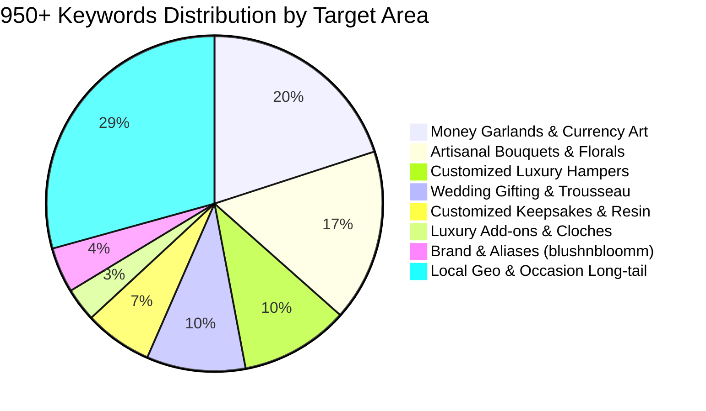

# Bloom&blush (blushnbloomm.in) — Master SEO Strategy & 950+ Keyword Taxonomy

**Website Domain:** [https://blushnbloomm.in](https://blushnbloomm.in)  
**Brand Identity:** Bloom&blush (Also known as *blushnbloomm*, *Bloom and blush*, *Blush & Bloom*)  
**Founder:** Siddhi Kokate  
**Base Location:** Pimpri-Chinchwad, Pune, Maharashtra  
**Service Region:** Pune Metropolitan Region & Pan-India Dispatch for Preserved Items  
**Primary Channels:** Direct WhatsApp Concierge (+91 81808 79442) & Instagram (@blushnbloomm.in)

---

## 1. Executive Summary of SEO Systems Implemented

| SEO System | Status | Implementation Details |
| :--- | :--- | :--- |
| **Custom Domain Canonicalization** | ✅ Active | Enforced `https://blushnbloomm.in` across all canonical tags, OpenGraph URLs, and sitemaps. |
| **Google XML Sitemap** | ✅ Active | [sitemap.xml](https://blushnbloomm.in/sitemap.xml) featuring image extension tags (`<image:image>`) for Google Image Search. |
| **HTML Visual Sitemap** | ✅ Active | [sitemap.html](https://blushnbloomm.in/sitemap.html) with responsive visual cards, breadcrumbs, and link graph. |
| **Robots Directives** | ✅ Active | [robots.txt](https://blushnbloomm.in/robots.txt) configured for Googlebot, Googlebot-Image, and Bingbot. |
| **Structured Data (JSON-LD)** | ✅ Active | `Florist`, `LocalBusiness`, `Store`, `WebSite` (with Sitelinks SearchBox), `FAQPage`, and `CollectionPage`. |
| **Interactive FAQ Section** | ✅ Active | 8 high-intent question & answer accordions optimized for Google Featured Snippets & PAA boxes. |
| **Local Geo Hubs Grid** | ✅ Active | Footer crawl cloud covering 14 key Pune & PCMC micro-markets (Wakad, Hinjawadi, Baner, Kothrud, etc.). |
| **Live Keyword Semantic Booster** | ✅ Active | Universal search bar (`js/search.js`) powered by the 950+ keywords taxonomy in `data/seo-keywords.json`. |

---

## 2. 950+ Targeted Keyword Clusters Breakdown

The database in [`data/seo-keywords.json`](file:///c:/Users/bhave/OneDrive/Desktop/blushnbloomm/data/seo-keywords.json) contains **950 individual high-intent search terms** structured across 8 commercial clusters:



### Cluster 1: Brand & Brand Aliases (50 Keywords)
*Target URL:* `https://blushnbloomm.in/`
- `blushnbloomm`, `blushnbloomm in`, `blushnbloomm com`, `blushnbloomm pune`, `blushnbloomm pimpri chinchwad`
- `bloom and blush`, `bloom and blush pune`, `bloom & blush`, `blush and bloom pune`
- `siddhi kokate`, `siddhi kokate pune`, `siddhi kokate floral designer`, `siddhi kokate money garland`
- `blushnbloomm reviews`, `blushnbloomm instagram`, `blushnbloomm whatsapp`, `blushnbloomm catalog`

### Cluster 2: Money Garlands & Currency Art (229 Keywords)
*Target URL:* `https://blushnbloomm.in/category.html?id=money-garlands`
- `money garland`, `currency garland`, `currency note garland`, `groom money garland`, `groom note haar`
- `500 rupee note garland`, `100 rupee note garland`, `200 rupee note garland`, `50 rupee note garland`
- `origami money garland`, `damage free money garland`, `zero pinhole currency garland`
- `money garland in pune`, `money garland pimpri chinchwad`, `money garland wakad`, `money garland baner`
- `baraat money garland`, `shagun currency garland`, `roka money garland`, `shashtipoorthi currency garland`
- `royal sovereign money garland`, `golden aura currency garland`, `punjabi groom money garland`

### Cluster 3: Artisanal Bouquets & Eternal Florals (190 Keywords)
*Target URL:* `https://blushnbloomm.in/category.html?id=bouquets`
- `bridal bouquet pune`, `wedding bouquet pune`, `hand tied bridal bouquet`, `wine garden rose bouquet`
- `preserved flower bouquet`, `eternal preserved roses`, `3 year preserved roses pune`
- `trailing velvet ribbon bouquet`, `eucalyptus bridal bouquet`, `blush ranunculus bouquet`
- `flower bouquet delivery pune`, `luxury florist in pimpri chinchwad`, `wedding proposal bouquet pune`
- `bridesmaid bouquet pune`, `groom boutonniere pune`, `matching corsage and boutonniere`
- `blush petal bridal bouquet`, `wine and blush bridal bouquet`, `editorial bouquet bloom and blush`

### Cluster 4: Customized Celebration Hampers (120 Keywords)
*Target URL:* `https://blushnbloomm.in/category.html?id=customized-hampers`
- `customized hampers`, `luxury hampers pune`, `celebration hampers pune`, `bespoke gift hampers`
- `burgundy velvet trunk hamper`, `dry fruit hamper with brass canisters`, `scented soy candle hamper`
- `bride to be hamper pune`, `groom hamper box`, `wedding welcome hamper`, `bridesmaid proposal hamper`
- `corporate luxury hampers pune`, `corporate diwali hampers pune`, `festive gift hampers pune`
- `velvet reverie celebration hamper`, `heritage brass and dry fruit hamper`, `wax sealed luxury gift box`

### Cluster 5: Wedding & Celebration Gifting / Trousseau (109 Keywords)
*Target URL:* `https://blushnbloomm.in/category.html?id=wedding-gifting`
- `wedding gifting pune`, `trousseau packing in pune`, `trousseau packing pimpri chinchwad`
- `luxury trousseau presentation trays`, `designer saree packing trays`, `bridal trousseau packing`
- `wedding ring tray decoration pune`, `engagement ring platter designer`, `shagun platters pune`
- `luxury zardozi potlis`, `embroidered velvet potlis`, `dry fruit potlis for wedding`
- `shagun envelopes luxury`, `custom coin boxes for shagun`, `kanyadaan ceremonial items presentation`

### Cluster 6: Customized Keepsakes & Resin Art (75 Keywords)
*Target URL:* `https://blushnbloomm.in/category.html?id=customized-gifts`
- `customized keepsakes pune`, `flower preservation pune`, `wedding varmala preservation resin`
- `resin flower preservation frame`, `preserved bridal bouquet frame`, `resin memory clock with varmala`
- `personalized wooden keepsake box`, `hand carved wooden memory box`, `brass calligraphy letters pune`
- `wedding invitation resin frame`, `photo and floral resin block`, `varmala preservation turnaround time`

### Cluster 7: Luxury Add-ons & Botanical Domes (37 Keywords)
*Target URL:* `https://blushnbloomm.in/category.html?id=luxury-addons`
- `preserved ecuadorian rose dome`, `preserved rose glass cloche`, `eternal rose in bell jar`
- `beauty and the beast rose dome pune`, `forever rose cloche pune`, `real rose lasting 3 years`
- `bridal hair floral jewelry pune`, `real flower jewelry for haldi`, `preserved rose boutonniere`

### Cluster 8: Local Geo-Targeting & Occasion Queries (336 Keywords)
*Target URLs:* `https://blushnbloomm.in/` & `https://blushnbloomm.in/sitemap.html`
- Micro-markets: `Pimpri-Chinchwad`, `Pune`, `Wakad`, `Hinjawadi`, `Baner`, `Kothrud`, `Aundh`, `Ravet`, `Nigdi`, `Viman Nagar`, `Koregaon Park`, `Kalyani Nagar`, `Magarpatta`
- Occasions: `Wedding Baraat`, `Roka & Engagement`, `Milestone 50th / 60th Birthday`, `Anniversaries`, `Baby Shower (Godh Bharai)`, `Festive Diwali Gifting`, `Housewarming (Griha Pravesh)`

---

## 3. Google Search Console & Indexing Setup Checklist

To enable Google to crawl and index blushnbloomm.in immediately:

1. **Verify Ownership on Google Search Console:**
   - Go to [Google Search Console](https://search.google.com/search-console).
   - Add property: `https://blushnbloomm.in`.
   - Verify via HTML tag (already present) or DNS TXT record.

2. **Submit the XML Sitemap:**
   - In GSC navigation, click **Sitemaps**.
   - Enter: `https://blushnbloomm.in/sitemap.xml`.
   - Click **Submit**. Google will automatically detect all 8 core URLs and image metadata.

3. **Verify Robots.txt:**
   - Inspect: `https://blushnbloomm.in/robots.txt` in the GSC Robots Testing tool.
   - Status should show 200 OK with `Allow: /` and sitemap reference.

4. **Test Rich Results:**
   - Test `https://blushnbloomm.in` on the [Google Rich Results Test](https://search.google.com/test/rich-results).
   - Verified schemas:
     - `Florist / LocalBusiness`
     - `WebSite`
     - `FAQPage`
     - `BreadcrumbList`

---

## 4. Technical File Structure

```
blushnbloomm/
├── CNAME                           # Canonical domain blushnbloomm.in
├── sitemap.xml                     # Google-compliant XML Sitemap with image tags
├── sitemap.html                    # Visual HTML directory & sitemap
├── robots.txt                      # Crawler directives for Googlebot & Bingbot
├── vercel.json                     # Clean URLs, cache headers & rewrites
├── index.html                      # SEO optimized flagship page with FAQ schema
├── category.html                   # Dynamic collection showcase with canonicals
├── data/
│   └── seo-keywords.json           # 950+ categorized keywords database
└── js/
    ├── search.js                   # Universal search with keyword semantic boost
    └── category.js                 # Dynamic metadata & JSON-LD updater
```
